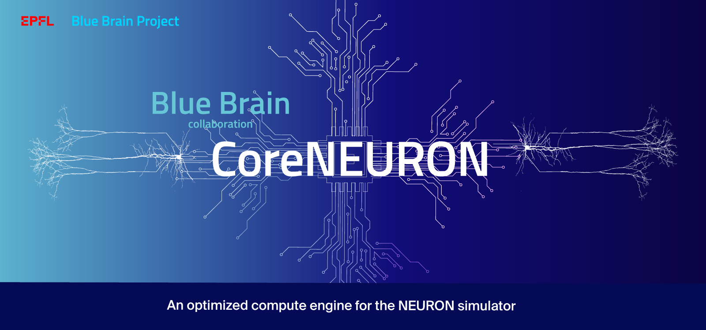

 :bangbang:
 **NOTE:** The CoreNEURON is now [integrated within NEURON](https://github.com/neuronsimulator/nrn/tree/master/src/coreneuron) simulator at the source level and hence all the latest development happens under the main GitHub project [neuronsimulator/nrn](https://github.com/neuronsimulator/nrn). To use CoreNEURON, see the latest NEURON documentation under [nrn.readthedocs.io](https://nrn.readthedocs.io/en/latest/).:bangbang:

_______________________________________________________

 

## Citation

If you would like to know more about CoreNEURON or would like to cite it, then use the following paper:

* Pramod Kumbhar, Michael Hines, Jeremy Fouriaux, Aleksandr Ovcharenko, James King, Fabien Delalondre and Felix Schürmann. CoreNEURON : An Optimized Compute Engine for the NEURON Simulator ([doi.org/10.3389/fninf.2019.00063](https://doi.org/10.3389/fninf.2019.00063))

## License
* See LICENSE.txt
* See [NEURON](https://github.com/neuronsimulator/nrn)

## Funding

CoreNEURON is developed in a joint collaboration between the Blue Brain Project and Yale University. This work is supported by funding to the Blue Brain Project, a research center of the École polytechnique fédérale de Lausanne (EPFL), from the Swiss government’s ETH Board of the Swiss Federal Institutes of Technology, NIH grant number R01NS11613 (Yale University), the European Union Seventh Framework Program (FP7/20072013) under grant agreement n◦ 604102 (HBP) and the European Union’s Horizon 2020 Framework Programme for Research and Innovation under Specific Grant Agreement n◦ 720270 (Human Brain Project SGA1), n◦ 785907 (Human Brain Project SGA2) and n◦ 945539 (Human Brain Project SGA3).

Copyright (c) 2016 - 2022 Blue Brain Project/EPFL
